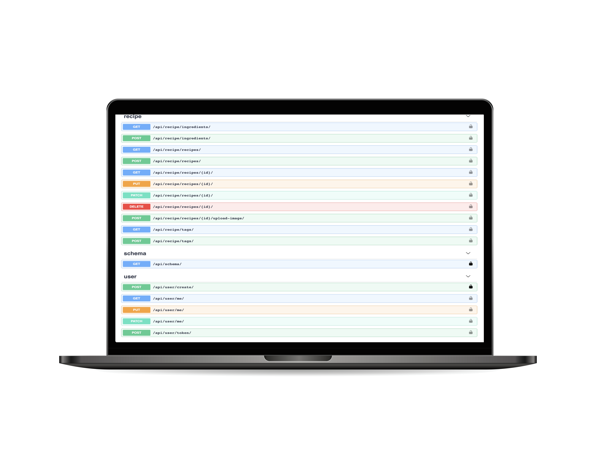

<!-- Improved compatibility of back to top link: See: https://github.com/othneildrew/Best-README-Template/pull/73 -->

<a name="readme-top"></a>

<!--
*** Thanks for checking out the Best-README-Template. If you have a suggestion
*** that would make this better, please fork the repo and create a pull request
*** or simply open an issue with the tag "enhancement".
*** Don't forget to give the project a star!
*** Thanks again! Now go create something AMAZING! :D
-->

<!-- PROJECT SHIELDS -->
<!--
*** I'm using markdown "reference style" links for readability.
*** Reference links are enclosed in brackets [ ] instead of parentheses ( ).
*** See the bottom of this document for the declaration of the reference variables
*** for contributors-url, forks-url, etc. This is an optional, concise syntax you may use.
*** https://www.markdownguide.org/basic-syntax/#reference-style-links
-->

<!-- PROJECT LOGO -->
<br />
<div align="center">

  <h3 align="center">Recipe App Api</h3>
  

  <p align="center">
    <br />
    <br />
    <a href="http://ec2-3-138-113-42.us-east-2.compute.amazonaws.com/api/docs/">View API Documentation</a>
    ·
  </p>
</div>

<!-- TABLE OF CONTENTS -->
<details>
  <summary>Table of Contents</summary>
  <ol>
    <li>
      <a href="#about-the-project">About The Project</a>
      <ul>
        <li><a href="#built-with">Built With</a></li>
      </ul>
    </li>
    <li>
      <a href="#getting-started">Getting Started</a>
    </li>
  </ol>
</details>

<!-- ABOUT THE PROJECT -->

## About The Project

This is a RESTful API built with Python and Django framework for recipe apps.

Main Features:
- Local development server with Docker
- Software development practice using Test Driven Development
- Write unit tests for endpoints using Django Test Framework
- Configure Github Actions to automatically run linting and unit tests
- Adding endpoints for creating and managing users, tags, ingredients, recipes
- Filtering for our list endpoints
- Uploading images
- Configure the Django admin and Postgres database
- Configure automatic API documentation with Swagger
- Deploying API to AWS EC2

<p align="right">(<a href="#readme-top">back to top</a>)</p>

### Built With

- [![Docker]][Docker]
- [![Python]][Python]
- [![DjangoREST]][DjangoREST]
- [![Postgres]][Postgres]
- [![Swagger]][Swagger]
- [![AWS]][AWS]

<p align="right">(<a href="#readme-top">back to top</a>)</p>

<!-- GETTING STARTED -->

## Getting Started

### Build Docker Image

```shell
docker-compose build
```

### Change 

### Run docker contaienr

```shell
docker-compose up

```

### Run Tests

```shell
docker-compose run --rm app sh -c "python manage.py test && flake8"
```

<p align="right">(<a href="#readme-top">back to top</a>)</p>

<!-- LICENSE

## License

TODO

<p align="right">(<a href="#readme-top">back to top</a>)</p> -->

<!-- ACKNOWLEDGMENTS -->

<!-- MARKDOWN LINKS & IMAGES -->
<!-- https://www.markdownguide.org/basic-syntax/#reference-style-links -->

[DjangoREST]: https://img.shields.io/badge/DJANGO-REST-ff1709?style=for-the-badge&logo=django&logoColor=white&color=ff1709&labelColor=gray
[Python]: https://img.shields.io/badge/python-3670A0?style=for-the-badge&logo=python&logoColor=ffdd54
[Postgres]: https://img.shields.io/badge/postgres-%23316192.svg?style=for-the-badge&logo=postgresql&logoColor=white
[AWS]: https://img.shields.io/badge/AWS-%23FF9900.svg?style=for-the-badge&logo=amazon-aws&logoColor=white
[Swagger]: https://img.shields.io/badge/-Swagger-%23Clojure?style=for-the-badge&logo=swagger&logoColor=white
[Docker]: https://img.shields.io/badge/docker-%230db7ed.svg?style=for-the-badge&logo=docker&logoColor=white